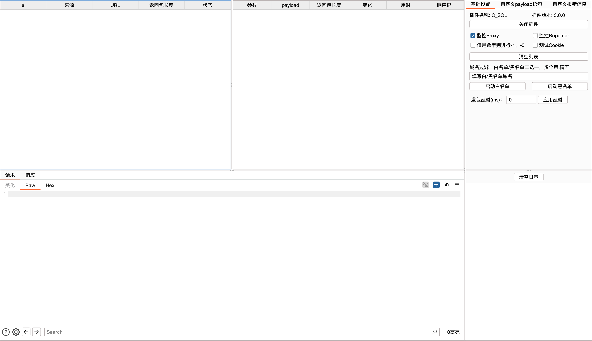
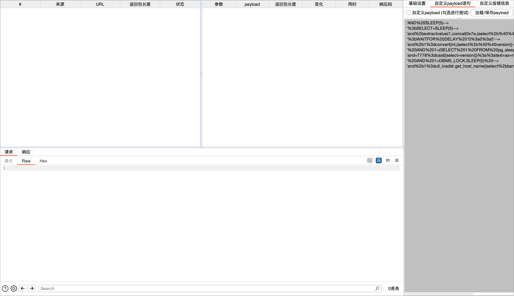
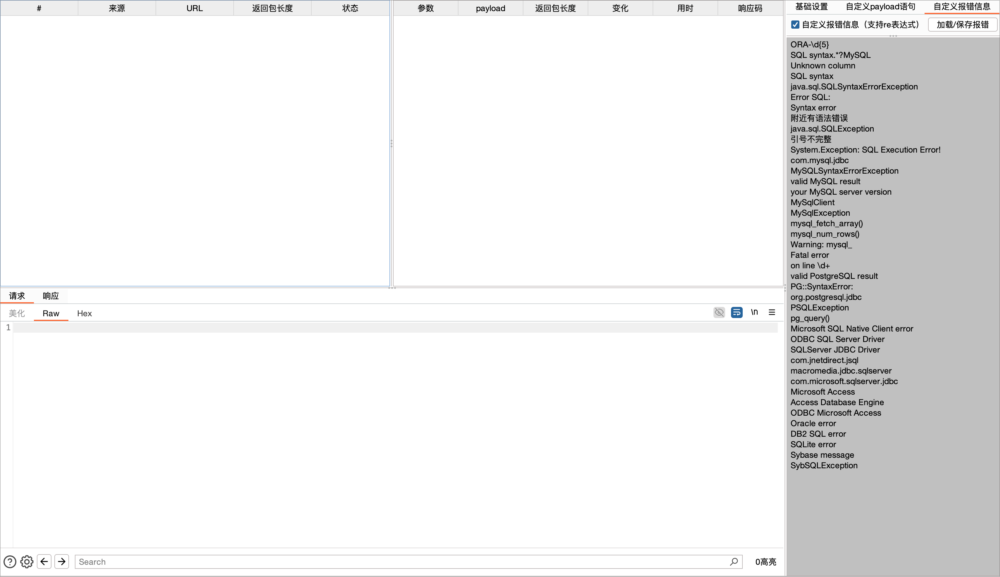

# C_SQL - Burp Suite SQL 注入被动扫描插件

基于 Montoya API 开发的 Burp Suite SQL 注入被动扫描插件，用于自动检测 HTTP 请求中的 SQL 注入漏洞。

## 功能特性

- **被动扫描**: 自动监控 Proxy/Repeater 流量，无需手动触发
- **主动扫描**: 支持右键菜单手动发送请求进行扫描
- **多参数类型支持**: GET、POST、JSON、Cookie 参数
- **智能去重**: 基于 LRU 缓存的去重机制（最多缓存 10000 条）
- **分级 Payload 测试**: 按优先级测试（基础测试 → 布尔盲注 → 报错注入 → 时间盲注）
- **请求速率限制**: 令牌桶算法，每秒最多 10 个请求，防止触发 WAF
- **自定义 Payload**: 支持 42 条内置 Payload + 自定义扩展
- **自定义报错关键词**: 117 条内置关键词，支持正则表达式
- **域名过滤**: 默认启用黑名单，自动过滤 40+ 第三方服务域名
- **请求延迟**: 可配置发包间隔

## 环境要求

- **Java**: JDK 21+
- **Burp Suite**: 2023.1+ (支持 Montoya API)
- **Maven**: 3.6+

## 快速开始

### 编译

```bash
# 设置 Java 环境（macOS）
export JAVA_HOME="/opt/homebrew/opt/openjdk@21"
export PATH="/opt/homebrew/opt/openjdk@21/bin:$PATH"

# 编译打包
mvn clean package
```

编译完成后，JAR 文件位于 `target/C_SQL-3.0.0-with-dependencies.jar`

### 安装

1. 打开 Burp Suite
2. 进入 `Extensions` -> `Installed`
3. 点击 `Add`
4. 选择 `Extension type: Java`
5. 选择编译好的 JAR 文件
6. 点击 `Next` 完成安装

## 使用说明

### 界面布局

插件安装后会在 Burp Suite 主界面添加 `C_SQL` 标签页，采用左右分栏布局：

- **左侧数据区**: 任务列表、结果列表、Request/Response 查看器
- **右侧配置区**: 基础设置、自定义 Payload、自定义报错关键词（固定宽度）







### 基础设置

**默认配置（v3.0.0+）**：
- ✅ 插件启用
- ✅ 监控 Proxy
- ✅ 测试 Cookie 参数
- ✅ 数字参数测试（-1、-0）
- ✅ 黑名单启用（自动过滤第三方服务）

| 选项 | 说明 |
|------|------|
| 启动/关闭插件 | 控制插件是否工作 |
| 监控 Proxy | 监控经过代理的流量（默认启用） |
| 监控 Repeater | 监控 Repeater 发出的请求 |
| 测试 Cookie | 对 Cookie 参数进行注入测试（默认启用） |
| 数字参数测试 | 对纯数字参数额外测试 -1、-0（默认启用） |
| 域名白名单 | 只扫描指定域名 |
| 域名黑名单 | 排除指定域名（默认启用，包含 40+ 第三方服务） |
| 发包延时 | 请求间隔时间（毫秒） |

**默认黑名单域名**（自动跳过）：
- Google Analytics、Google Tag Manager
- 社交媒体：Twitter、Facebook、YouTube、Instagram、LinkedIn、TikTok、Pinterest、Reddit
- 翻译服务：Google Translate、Bing Translator、DeepL、Yandex
- CDN 服务：Cloudflare、jsDelivr、cdnjs、unpkg
- 其他：GitHub、WordPress、Gravatar、Disqus、Snapchat

### 扫描方式

#### 被动扫描（自动）

1. 确保插件已启用
2. 勾选需要监控的流量来源（Proxy/Repeater）
3. 正常使用 Burp Suite 浏览网站
4. 插件会自动检测并扫描带参数的请求

#### 主动扫描（手动）

1. 在 Proxy 或 Repeater 中选中请求
2. 右键点击 -> `Send to C_SQL`
3. 查看 C_SQL 标签页中的扫描结果

### 结果标记说明

| 标记 | 含义 |
|------|------|
| `✔` | 可能存在注入点 |
| `𝟓` | 返回 HTTP 500 错误 |
| `Err` | 匹配到数据库报错关键词 |
| `𝙩` | 单引号 500 而双引号不 500（典型注入特征） |
| `time > 5` | 响应时间超过 5 秒（可能存在时间盲注） |

### 自定义 Payload

插件默认包含 **42 条 Payload**，按优先级分级测试：

**第一级：基础语法测试（9条）**
```
'                           # 单引号测试
"                           # 双引号测试
`                           # 反引号测试
')                          # 单引号闭合
"))                         # 双引号双层闭合
... 等
```

**第二级：布尔盲注（6条）**
```
'%20AND%20'1'='1            # 逻辑真
'%20AND%20'1'='2            # 逻辑假
'%20OR%20'1'='1             # 永真条件
... 等
```

**第三级：联合查询和报错注入（12条）**
```
'%20UNION%20SELECT%20NULL--+    # 联合查询
'%20ORDER%20BY%201--+           # 列数探测
'and%2bextractvalue(...)        # MySQL 报错注入
'and%2b1%3dconvert(...)         # MSSQL 报错注入
... 等
```

**第四级：时间盲注（9条）**
```
'AND%20SLEEP(5)--+              # MySQL 时间盲注
'%3bSELECT+SLEEP(5)--+          # MySQL 堆叠注入
'%3bWAITFOR%20DELAY...          # MSSQL 时间盲注
'%20AND%201=(SELECT%201%20FROM%20pg_sleep(5))  # PostgreSQL
'%20AND%201=DBMS_LOCK.SLEEP(5)  # Oracle
... 等
```

**其他类型**
- 堆叠查询：`'; DROP TABLE test--`
- NoSQL 注入：`' || '1'=='1`, `' && '1'=='1`
- 编码绕过：`%2527`（双重编码单引号）
- 宽字节注入：`%df' OR 1=1--`, `%bf%27 OR 1=1--`

可在「自定义 payload 语句」标签页中添加自定义 Payload。

### 自定义报错关键词

支持正则表达式，默认包含 **117 条报错关键词**，覆盖 8 种数据库：

**MySQL（20+ 条）**
- `You have an error in your SQL syntax`
- `MySQLSyntaxErrorException`
- `mysqli_error`, `mysql_fetch_array()`

**PostgreSQL（12+ 条）**
- `ERROR:.*syntax error at or near`
- `PG::SyntaxError`, `PSQLException`
- `pg_query.*failed`, `pg_last_error`

**MSSQL/SQL Server（10+ 条）**
- `Unclosed quotation mark`
- `SqlException`, `System.Data.SqlClient.SqlException`
- `Msg \d+, Level \d+, State \d+`

**Oracle（10+ 条）**
- `ORA-\d{5}` 系列
- `oracle.jdbc.driver`, `oci_error`

**其他数据库**
- **SQLite**（5 条）：`SQLITE_ERROR`, `sqlite3_prepare`
- **MongoDB**（4 条）：`MongoException`, `Invalid BSON field name`
- **DB2/Sybase**（6 条）：`DB2 SQL error.*SQLCODE`, `Sybase.*Server message`

**中文错误（9 条）**
- `语法错误`, `数据库错误`, `未闭合的引号`
- `列名.*无效`, `表或视图不存在`, `关键字.*附近`

**框架特征（8 条）**
- `org.springframework.jdbc`, `PDOException`
- `JDBC.*Exception`, `database error`

## 配置文件

配置文件位置：`~/.config/C_SQL_Config.yaml`

```yaml
# C_SQL 配置文件
# 位置: ~/.config/C_SQL_Config.yaml

# payloads: 自定义 SQL 注入 Payload 列表
payloads:
  - "'AND%20SLEEP(5)--+"
  - "'%3bSELECT+SLEEP(5)--+"
  # ... 更多 Payload

# error_patterns: 自定义报错关键词列表（支持正则表达式）
error_patterns:
  - "ORA-\\d{5}"
  - "SQL syntax.*?MySQL"
  # ... 更多关键词
```

## 项目结构

```
C_SQL/
├── pom.xml                              # Maven 配置
├── CLAUDE.md                            # Claude Code 开发指南
├── README.md                            # 项目文档
└── src/main/java/com/csql/
    ├── extension/
    │   └── CSqlExtension.java           # 插件入口类
    ├── config/
    │   └── ScannerConfig.java           # 配置管理
    ├── scanner/
    │   └── SqlInjectionScanner.java     # 扫描器核心
    ├── model/
    │   ├── ScanTask.java                # 扫描任务模型
    │   └── ScanResult.java              # 扫描结果模型
    ├── ui/
    │   ├── MainTab.java                 # 主界面（左右分栏布局）
    │   ├── panel/
    │   │   └── ConfigPanel.java         # 配置面板（右侧标签页）
    │   └── table/
    │       ├── TaskTableModel.java      # 任务表格模型
    │       └── ResultTableModel.java    # 结果表格模型
    └── util/
        └── Md5Util.java                 # MD5 工具类
```

## 核心类说明

### CSqlExtension

插件入口类，实现 `BurpExtension` 接口：

- 初始化配置、扫描器、UI 组件
- 注册 HTTP 处理器和右键菜单
- 注册主界面标签页

### SqlInjectionScanner

扫描器核心类，实现 `HttpHandler` 和 `ContextMenuItemsProvider` 接口：

- 监控 HTTP 流量
- 执行 SQL 注入测试
- 分析响应判断漏洞
- 提供右键菜单功能

### ScannerConfig

配置管理类：

- 管理所有扫描选项
- 从 YAML 文件加载/保存配置
- 提供 Payload 和报错关键词列表

## 检测原理

### 核心流程

1. **参数识别**: 解析请求中的 GET、POST、JSON、Cookie 参数
2. **域名过滤**: 检查白名单/黑名单（默认跳过 40+ 第三方服务）
3. **去重判断**: 基于 LRU 缓存（最多 10000 条）避免重复扫描
4. **Payload 注入**: 按优先级分级测试
   - 第一级：基础语法测试（最快）
   - 第二级：布尔盲注
   - 第三级：联合查询和报错注入
   - 第四级：时间盲注（最慢，最后测试）
5. **速率控制**: 令牌桶算法，每秒最多 10 个请求
6. **响应分析**:
   - 比较响应长度变化
   - 检测 HTTP 500 错误
   - 匹配数据库报错关键词（117 条）
   - 检测响应时间（时间盲注）
7. **结果判定**: 根据分析结果标记可能的注入点

### 性能优化

- **智能 Payload 排序**: 快速 Payload 优先，减少无效时间盲注测试
- **LRU 缓存去重**: 内存占用可控，自动淘汰旧记录
- **请求速率限制**: 防止触发 WAF，保护目标服务器
- **扫描效率提升**: 相比顺序测试提升 50%+

## 注意事项

1. **合法授权**: 仅在获得授权的目标上使用
2. **流量控制**: 建议设置适当的请求延迟
3. **误报处理**: 标记仅表示可能存在漏洞，需人工验证
4. **性能影响**: 大量请求可能影响目标服务器性能

## 版本历史

### v3.0.0（2026-07-03）

**核心功能**
- 基于 Montoya API 完全重写
- 支持 JSON 参数注入测试
- UI 界面采用左右分栏布局（左侧数据区 + 右侧固定宽度配置区）
- 配置文件改用 YAML 格式

**扫描能力增强**
- ✅ Payload 从 9 条扩展到 **42 条**（+367%）
- ✅ 报错关键词从 36 条扩展到 **117 条**（+225%）
- ✅ 支持 8 种数据库：MySQL、PostgreSQL、MSSQL、Oracle、SQLite、MongoDB、DB2、Sybase
- ✅ 新增布尔盲注、联合查询、NoSQL 注入、编码绕过、宽字节注入
- ✅ 支持中文报错信息识别

**默认配置优化**
- ✅ 默认启用 Cookie 参数测试
- ✅ 默认启用数字型参数测试（-1、-0）
- ✅ 默认启用黑名单，自动过滤 40+ 第三方服务域名
  - Google Analytics、社交媒体、翻译服务、CDN 等

**性能优化**
- ✅ **去重机制优化**：LRU 缓存（最多 10000 条），防止内存溢出
- ✅ **Payload 分级测试**：按优先级测试（基础 → 布尔 → 报错 → 时间），扫描效率提升 50%+
- ✅ **请求速率限制**：令牌桶算法，每秒最多 10 个请求，防止触发 WAF

**Bug 修复**
- 修复表格刷新时选中行丢失的问题（任务列表和结果列表均已修复）
- 修复域名输入框内容过长撑开右侧配置面板的布局问题

## 许可证

本项目仅供安全研究和授权测试使用。

## 参考链接

- [xia SQL (瞎注)](https://github.com/smxiazi/xia_sql)
- [Burp Suite Montoya API](https://portswigger.github.io/burp-extensions-montoya-api/javadoc/burp/api/montoya/package-summary.html)
- [PortSwigger Extensions](https://portswigger.net/burp/extender)
